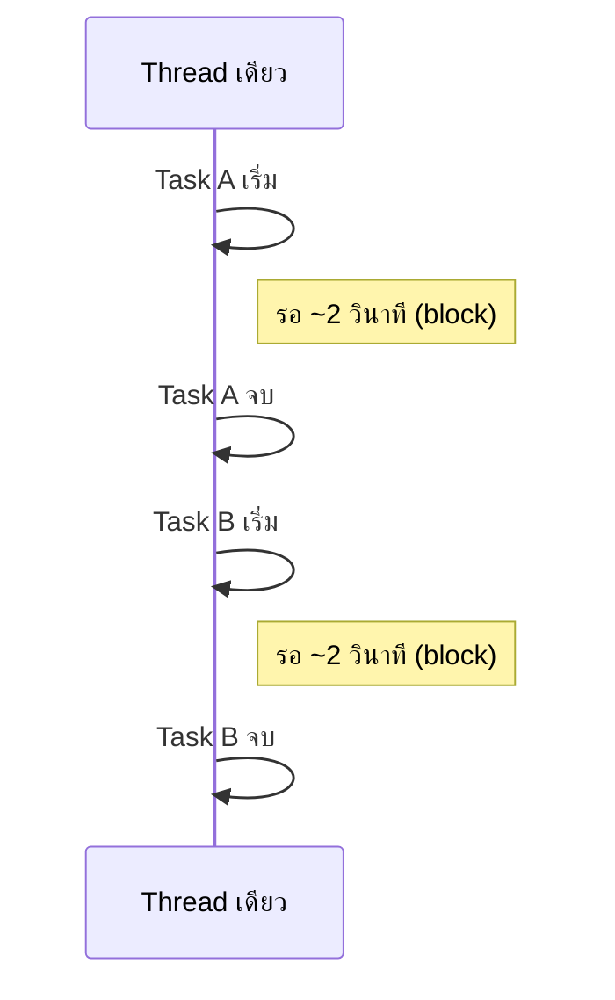
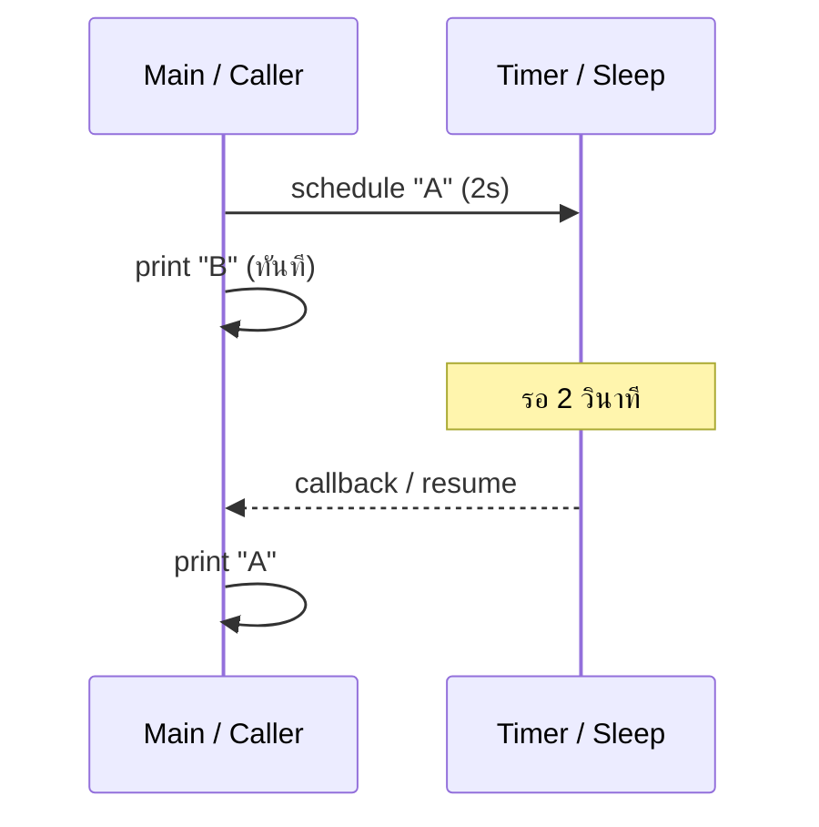
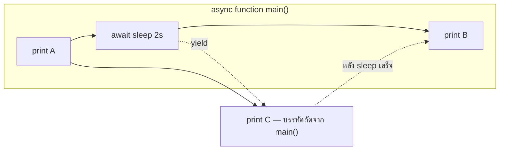
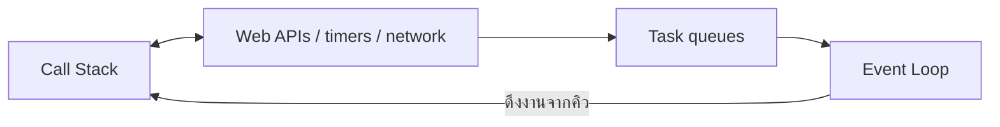
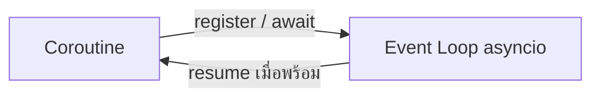
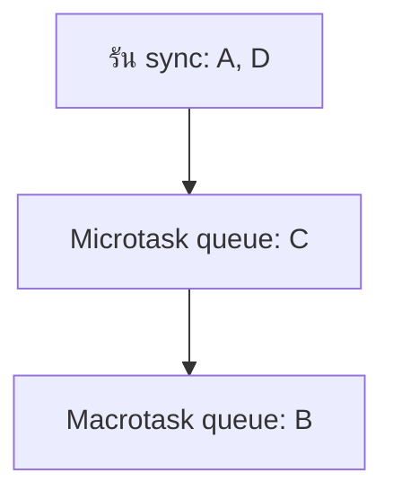

# Sync, Async และ Await — JavaScript กับ Python

เอกสารนี้สรุปจากพื้นฐานจนถึงการใช้งานจริง ให้เห็นภาพเดียวกันทั้ง **JavaScript** และ **Python**

---

## สารบัญ

1. [Sync (ทำงานทีละขั้น)](#_1-sync-synchronous)
2. [Async (ไม่ต้องยืนรอแบบบล็อก)](#_2-async-asynchronous)
3. [Await คืออะไร](#_3-await)
4. [Event Loop](#_4-event-loop)
5. [Microtask vs Macrotask (เฉพาะ JavaScript)](#_5-microtask-vs-macrotask-javascript)
6. [Promise กับ Coroutine](#_6-promise-vs-coroutine)
7. [ทำไม `async function` ใน JS คืนค่าเป็น Promise](#_7-ทำไม-async-function-ใน-js-คืนค่าเป็น-promise)
8. [ทำไม Python ต้องใช้ `asyncio`](#_8-ทำไม-python-ต้องใช้-asyncio)
9. [ตารางเปรียบเทียบสำคัญ](#_9-ตารางเปรียบเทียบสำคัญ)
10. [เปรียบเทียบแบบชีวิตจริง](#_10-เปรียบเทียบแบบชีวิตจริง)
11. [สรุป](#_11-สรุป)
12. [เมื่อไหร่ควร / ไม่ควรใช้ Async](#_12-เมื่อไหร่ควร--ไม่ควรใช้-async)

---

## 1. Sync (Synchronous)

### ความหมาย

ทำงาน **ทีละอย่าง** — ต้องรอให้งานหนึ่ง **เสร็จก่อน** ถึงจะเริ่มงานถัดไป (ในกระบวนการเดียวหรือเธรดเดียวที่พูดถึง)

### ภาพรวม timeline

งาน A และ B ทำ **ทีละงาน** — รวมเวลาประมาณ **4 วินาที** (2 + 2)



### JavaScript

```javascript
function task(name) {
  console.log("Start " + name);
  const start = Date.now();
  while (Date.now() - start < 2000) {} // block ~2 วินาที (busy-wait)
  console.log("End " + name);
}

task("A");
task("B");
// ~4 วินาที — B เริ่มหลัง A เสร็จ
```

### Python

```python
import time

def task(name):
    print(f"Start {name}")
    time.sleep(2)
    print(f"End {name}")

task("A")
task("B")
# ~4 วินาที — เช่นเดียวกัน
```

**สรุป:** Sync = รอจนเสร็จ → แล้วค่อยไปต่อ

---

## 2. Async (Asynchronous)

### ความหมาย

ไม่ต้อง **ยืนรอแบบบล็อกเธรด** — ส่งงานที่ต้องรอ (เช่น timer, I/O) ไปให้ระบบจัดการ แล้วทำอย่างอื่นก่อน ค่อยกลับมาทำต่อเมื่อพร้อม

### ผลลัพธ์แบบลำดับข้อความ

งานที่ต้องรอ 2 วินาที แต่พิมพ์ข้อความอื่นก่อนได้ → มักเห็น **B ก่อน A**



### JavaScript

```javascript
setTimeout(() => {
  console.log("A");
}, 2000);

console.log("B");
// ผลลัพธ์: B แล้วตามด้วย A (หลัง ~2 วินาที)
```

### Python (`asyncio`)

```python
import asyncio

async def task():
    await asyncio.sleep(2)
    print("A")

async def main():
    asyncio.create_task(task())
    print("B")

asyncio.run(main())
# ผลลัพธ์: B แล้วตามด้วย A
```

**สรุป:** Async = ไม่ยืนรอแบบบล็อก → สลับไปทำอย่างอื่น → ค่อยกลับมาทำต่อ

---

## 3. Await

### ความหมาย

`await` คือ **จุดพัก** ในโค้ด async: บอกว่า “ตรงนี้รอผลจากงานแบบ async ได้” — **ไม่ busy-wait** แต่ **yield คืนให้ event loop** ไปรันงานอื่นที่รอคิวได้

### ลำดับการพิมพ์ A, C, B

ทั้ง JS และ Python เมื่อมี `await` ระหว่าง `A` กับ `B` และมีบรรทัด `C` อยู่ **นอก** `async function` ที่รันแบบไม่บล็อก — ลำดับมักเป็น **A → C → B**



### JavaScript

```javascript
async function main() {
  console.log("A");
  await new Promise((r) => setTimeout(r, 2000));
  console.log("B");
}

main();
console.log("C");

// ผลลัพธ์: A, C, B
```

### Python

```python
import asyncio

async def main():
    print("A")
    await asyncio.sleep(2)
    print("B")

asyncio.run(main())
print("C")

# ผลลัพธ์: A, C, B
```

**หมายเหตุ:** หลัง `await` โค้ดที่เหลือใน `main()` จะรันต่อหลัง timer เสร็จ — จึงเห็น `B` หลัง `C`

---

## 4. Event Loop

### บทบาท

- รับงาน async / callback / coroutine ที่พร้อมจะรัน
- จัดคิวให้ทำงานทีละ “เทิร์น” อย่างไม่บล็อก
- เมื่องานที่รอเสร็จ → นำ continuation กลับมารัน

### JavaScript (แนวคิด)



### Python (`asyncio`)



---

## 5. Microtask vs Macrotask (JavaScript)

งานจาก **Promise** (microtask) จะรัน **ก่อน** งานจาก **`setTimeout`** (macrotask) ในรอบเดียวกันของ event loop

```javascript
console.log("A");

setTimeout(() => console.log("B"), 0); // macrotask
Promise.resolve().then(() => console.log("C")); // microtask

console.log("D");

// ผลลัพธ์: A, D, C, B
```



**กฎสั้น ๆ:** Microtask (เช่น `.then` ของ Promise) มาก่อน Macrotask (`setTimeout`)

---

## 6. Promise vs Coroutine

| แนวคิด | JavaScript | Python |
|--------|------------|--------|
| ประกาศฟังก์ชัน async | `async function` | `async def` |
| ค่าที่ได้เมื่อเรียก | `Promise` | `Coroutine` object |
| รอผลแบบ async | `await` Promise | `await` coroutine / awaitable |
| รัน entrypoint | เรียก `main()` / top-level await ในบริบทที่รองรับ | `asyncio.run(main())` |

---

## 7. ทำไม `async function` ใน JS คืนค่าเป็น Promise

ฟังก์ชันที่ประกาศด้วย `async` จะ **ห่อค่าที่ return** เป็น Promise เสมอ

```javascript
async function test() {
  return 42;
}
// เทียบเท่า conceptually: Promise.resolve(42)
```

---

## 8. ทำไม Python ต้องใช้ `asyncio`

- **`await` ใช้ได้เฉพาะภายใน** `async def` (และบริบทที่กฎภาษาอนุญาต)
- ต้องมี **event loop** เป็นตัวขับ coroutine — โดยทั่วไปใช้ `asyncio.run(main())`

```python
# result = await get_data()  # ❌ ไม่ได้ — ไม่ได้อยู่ใน async function + loop

import asyncio

async def main():
    result = await get_data()
    return result

asyncio.run(main())
```

**สรุปสั้น ๆ:** ใน JS runtime ของเบราว์เซอร์/Node มี event loop เป็นส่วนหนึ่งของโมเดลการทำงาน — ใน Python ต้องใช้ **`asyncio`** (หรือไลบรารี async อื่น) เพื่อรัน coroutine อย่างเป็นทางการ

---

## 9. ตารางเปรียบเทียบสำคัญ

| เรื่อง | JavaScript | Python |
|--------|------------|--------|
| async เป็นค่าเริ่มต้นของทุกฟังก์ชัน | ไม่ใช่ — เฉพาะที่ประกาศ `async` | ไม่ใช่ — เฉพาะ `async def` |
| Event loop | มีใน runtime (เบราว์เซอร์ / Node) | ใช้ `asyncio` (หรือ lib อื่น) |
| การรัน coroutine | `async` function return Promise แล้ว await | ต้องส่งเข้า loop เช่น `asyncio.run` |

---

## 10. เปรียบเทียบแบบชีวิตจริง

| แบบ | เปรียบเทียบ |
|-----|-------------|
| **Sync** | สั่งอาหารแล้ว **ยืนรอ** ที่เคาน์เตอร์จนได้อาหาร แล้วค่อยไปทำอย่างอื่น |
| **Async** | สั่งอาหาร **ได้คิว/ป้าย** แล้วไปทำอย่างอื่นก่อน พอถึงคิวค่อยกลับมารับ |

---

## 11. สรุป

| คำ | ความหมายโดยย่อ |
|----|----------------|
| **Sync** | ทำทีละงานจนจบก่อนค่อยถัดไป (ในเธรดเดียว) |
| **Async** | ไม่ยืนรอแบบบล็อก — สลับไปทำอย่างอื่นระหว่างรอ |
| **Await** | จุดที่ยอมให้ yield — ไม่กิน CPU รอแบบหมุน |
| **JS** | `async`/`await` ทำงานบน Promise + event loop ของ runtime |
| **Python** | ต้องมี loop เช่น **`asyncio`** เพื่อดัน coroutine ให้รัน |

---

## 12. เมื่อไหร่ควร / ไม่ควรใช้ Async

**เหมาะกับ Async เมื่อ:**

- เรียก API / เครือข่าย
- เชื่อมต่อฐานข้อมูล
- I/O ที่รอได้หลายงานพร้อมกัน
- หลายอุปกรณ์หรือการเชื่อมต่อแบบไม่ต้องบล็อกเธรดหลัก

**ไม่ใช้ Async แทนทุกอย่าง:**

- งาน **หนัก CPU** (เช่น AI, ประมวลผลภาพใหญ่ ๆ) — ใช้ **multiprocessing**, worker pool, หรือ offload ไปเธรด/โปรเซสอื่นแทนการคิดว่า async จะทำให้ CPU-bound เร็วขึ้น

### Insight สุดท้าย

**Async ไม่ได้ทำให้ “เร็วขึ้น” ในทุกกรณี** — แต่ช่วยให้ **ไม่เสียเวลายืนรอ** และจัดการ **หลายงานที่รอ I/O พร้อมกัน** ได้ดีขึ้น
