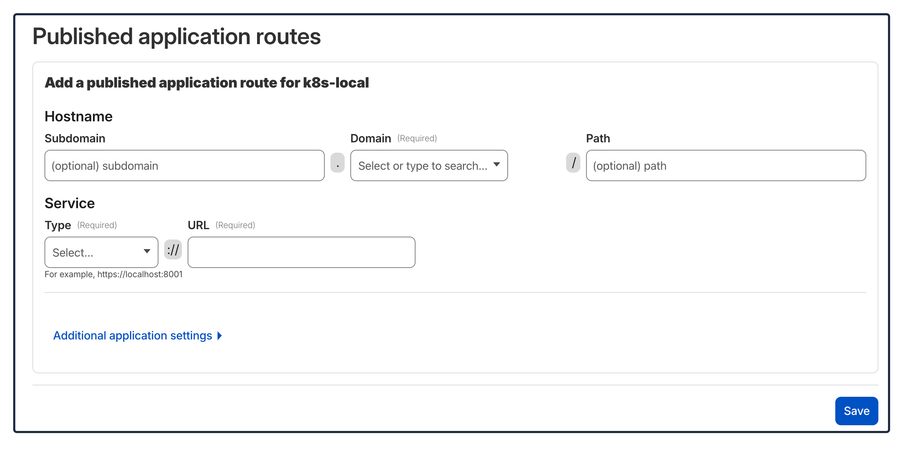

# Kong Ingress บน Kubernetes กับ Cloudflare

ใช้ Kong เป็น Ingress Controller และ Cloudflare Tunnel เพื่อ expose แอปจาก K8s cluster ออกอินเทอร์เน็ตโดยไม่ต้องเปิด port หรือ public IP

**Flow:** `Internet → Cloudflare Tunnel → Kong Ingress → Service → Pod`

--------------------------------------------------------------------------------

## 🚀 ติดตั้ง Kong Ingress

```sh
helm repo add kong https://charts.konghq.com
helm repo update

kubectl create namespace kong

helm install kong kong/kong \
  --namespace kong \
  --set ingressController.installCRDs=false \
  --set proxy.type=ClusterIP

kubectl get pods -n kong
```

> 💡 **หมายเหตุ:** `proxy.type=ClusterIP` เพราะใช้ Cloudflare Tunnel เป็นทางเข้า ไม่ต้องใช้ LoadBalancer/NodePort

--------------------------------------------------------------------------------

## 📦 Deploy แอปตัวอย่าง

### Step 1: สร้าง Deployment

```yaml
# app-deployment.yaml
apiVersion: apps/v1
kind: Deployment
metadata:
  name: nginx-deployment
  labels:
    app: nginx-deployment
spec:
  replicas: 2
  selector:
    matchLabels:
      app: nginx-app
  template:
    metadata:
      labels:
        app: nginx-app
    spec:
      containers:
        - name: nginx-app
          image: nginx:1.14.2
          ports:
            - containerPort: 80
```

### Step 2: สร้าง Service

```yaml
# app-service.yaml
apiVersion: v1
kind: Service
metadata:
  name: nginx-service
spec:
  type: ClusterIP
  selector:
    app: nginx-app
  ports:
    - name: http
      port: 80
      targetPort: 80
```

> 💡 **หมายเหตุ:** ใช้ ClusterIP ก็พอ เพราะ Kong ใน cluster จะ route traffic ให้

### Step 3: Apply

```sh
kubectl apply -f app-deployment.yaml
kubectl apply -f app-service.yaml
```

--------------------------------------------------------------------------------

## 🔀 สร้าง Ingress ให้ Kong

```yaml
# ingress.yaml
apiVersion: networking.k8s.io/v1
kind: Ingress
metadata:
  name: nginx-ingress
  namespace: default
spec:
  ingressClassName: kong
  rules:
    - host: local-kong.example.com
      http:
        paths:
          - path: /
            pathType: Prefix
            backend:
              service:
                name: nginx-service
                port:
                  number: 80
```

```sh
kubectl apply -f ingress.yaml
kubectl get ingress
```

--------------------------------------------------------------------------------

## 🌐 ติดตั้ง Cloudflare Tunnel

### Step 1: ติดตั้ง cloudflared

```sh
# macOS
brew install cloudflared

# Linux (arm64)
curl -L https://github.com/cloudflare/cloudflared/releases/latest/download/cloudflared-linux-arm64.deb -o cloudflared.deb
sudo dpkg -i cloudflared.deb

cloudflared --version
```

### Step 2: Login

```sh
cloudflared tunnel login
```

### Step 3: สร้าง Tunnel บน Cloudflare

1. ไปที่ **Zero Trust** → **Networks** → **Connectors** → สร้าง Tunnel
2. ใน **Public hostnames** เพิ่ม route:
   - **Subdomain:** `local-kong` (หรือตาม domain ที่ใช้)
   - **Domain:** เลือก domain ของคุณ
   - **Service:** `http://kong-kong-proxy.kong.svc.cluster.local:8000`



--------------------------------------------------------------------------------

## 🔐 สร้าง Secret สำหรับ Tunnel

```sh
# ดึง token จาก Cloudflare (ใช้ tunnel ที่สร้างไว้)
cloudflared tunnel token <your-tunnel-id>

kubectl create secret generic cloudflared-token \
  --from-literal=TUNNEL_TOKEN=<วาง-token-ตรงนี้>
```

--------------------------------------------------------------------------------

## 📤 Deploy cloudflared ใน Kubernetes

```yaml
# cloudflared.yaml
apiVersion: apps/v1
kind: Deployment
metadata:
  name: cloudflared
spec:
  replicas: 1
  selector:
    matchLabels:
      app: cloudflared
  template:
    metadata:
      labels:
        app: cloudflared
    spec:
      containers:
        - name: cloudflared
          image: cloudflare/cloudflared:latest
          args:
            - tunnel
            - --no-autoupdate
            - run
          env:
            - name: TUNNEL_TOKEN
              valueFrom:
                secretKeyRef:
                  name: cloudflared-token
                  key: TUNNEL_TOKEN
```

```sh
kubectl apply -f cloudflared.yaml
```

--------------------------------------------------------------------------------

## ✅ ทดสอบ

เปิด URL ที่ตั้งไว้บน Cloudflare เช่น `https://local-kong.example.com`
